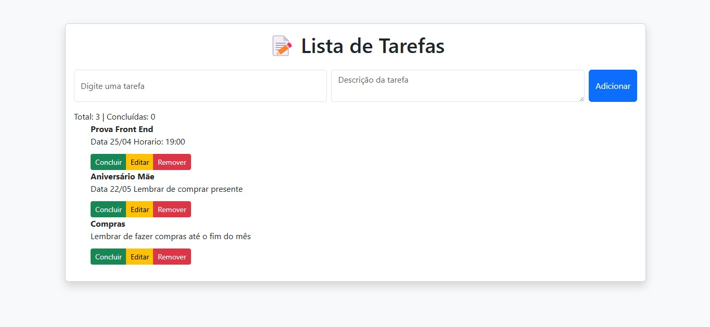

<h1 align="center">Projeto Sistema de Tarefas</h1>

## Descrição do projeto

### Objetivo Geral:

Desenvolver um sistema que seja intuitivo e responsivo com a finalidade de marcar tarefas e suas descrições, proporcionando uma forma de se organizar facilitado as anotações.

### Objetivos Específicos:
- Criar um sistema de fácil uso, permitindo que os usuários consigam marcar suas tarefas que devem ser feitas e adicionar descrições à elas.
- Implementar funções que seja possível marcar as tarefas como concluidas, que seja possível fazer edições tanto na tarefa como na descrição, e que seja possivel apagar a tarefa.
- Garantir a compatibilidade do sistema com dispositivos móveis, proporcionando uma experiência fluída e responsiva em smartphones e tablets.

### Linguagens de programação

``HTML5``: Será utilizado para a estruturação do conteúdo do sistema, criando os titulos, formulários e organizando as informações de forma semântica e acessível. O HTML proporcionará a base do sistema, garantindo que todos os elementos sejam corretamente dispostos.  
``Bootstrap 5.3.2``: Responsável pela estilização e layout do sistema. Utilizamos o Bootstrap para definir a aparência visual, como cores, fontes, espaçamento e responsividade, garantindo que o sistema tenha um design atraente e adaptável a diferentes tamanhos de tela.  
``Java Script``: Será utilizado para adicionar interatividade ao sistema, implementando funcionalidades como botão de excluir, concluir e editar. O JavaScript também permitirá melhorar a experiência do usuário, tornando o sistema mais interativo e fluido.

## Preview

# Autor

[ Deivid Aparecido  Galindo Oliveira](https://github.com/DeividGalindo) |